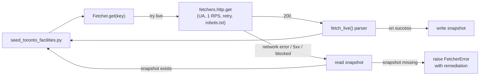

# `infra/data/` — data layer reference

Forward reference for everything under `infra/data/` and how each seeded
table is sourced. Pair with [`infra/README.md`](../README.md) for the
broader infrastructure overview and with
[`infra/supabase/seed.sql`](../supabase/seed.sql) for the SQL bootstrap.

## TL;DR

Every seeded row in BakeryPilot's PostgreSQL belongs to one of four
tiers, defined by *where the data came from* — not just *how it was
loaded*. The framework in [`infra/fetchers/`](../fetchers/) handles
Tier 1; this directory holds the data for Tiers 2, plus the cache
snapshots that make Tier 1 offline-friendly.

## Directory layout

```
infra/data/
├── ingredients.csv                   # Reference list mirrored into seed.sql ingredients block (Tier 3)
├── cache/                            # JSON snapshots written by the fetcher framework
│   ├── fgf_contact/
│   │   └── default.json              # FGF Brands /contact page (7-day TTL)
│   └── nominatim/
│       └── <safe-key>.json           # OpenStreetMap geocoder (90-day TTL)
├── demo_placeholders/                # Operational defaults + landmark proxy addresses
│   └── facilities.yaml               # Read by infra/seed_toronto_facilities.py
└── synthetic/                        # Labelled-synthetic config (no public source exists)
    ├── allergen_changeovers.yaml     # 27 rows
    ├── production_formulas.yaml      # 58 rows
    ├── production_lines.yaml         # 9 rows
    └── warehouse_costs.yaml          # 12 rows
```

## Source-of-truth tier per table

### Tier 1 — fully live-fetched

Real public source, refreshed every run, snapshot-cached on success.

| Table | Public source | Fetcher | Cache TTL |
|---|---|---|---|
| `facilities.street_address` / `postal_code` (plant-toronto only) | `fgfbrands.com/contact` HTML | [`fetchers/fgf_contact.py`](../fetchers/fgf_contact.py) | 7 days |
| `facilities.latitude` / `longitude` (all 4 plants) | OpenStreetMap Nominatim API | [`fetchers/nominatim.py`](../fetchers/nominatim.py) | 90 days |

**Operational caveat**: Cloudflare 403s the FGF live request from
non-browser clients, so plant-toronto's address is served from the
checked-in cache snapshot under `cache/fgf_contact/default.json` on
most networks. The framework prints a `[fgf_contact] WARN live fetch
failed … falling back to cache aged Ns` line every run so a stale or
suspect snapshot is impossible to miss. The snapshot was verified
against the live page when it was created.

### Tier 2 — labelled-synthetic (no public source)

Engineering-judgment configuration. Every row tagged
`source: engineering_judgment_demo_only` so an observer can audit-trail
it as non-real. Loaded by [`infra/seed_synthetic.py`](../seed_synthetic.py).

| Table | YAML | Rows | Why synthetic |
|---|---|---|---|
| `production_lines` | `synthetic/production_lines.yaml` | 9 | Plant line layouts are internal ops data, never published. |
| `warehouse_costs` | `synthetic/warehouse_costs.yaml` | 12 | Per-plant storage rates are internal procurement data; values calibrated to industry norms (~$0.012/kg/day frozen, ~$0.0025 dry). |
| `allergen_changeovers` | `synthetic/allergen_changeovers.yaml` | 27 | Sanitation timings are food-safety qualitative; calibrated against industry best practice. |
| `production_formulas` | `synthetic/production_formulas.yaml` | 58 | Recipes are proprietary trade secrets; values calibrated against published net weight + standard bakery ratios. |
| `facilities` operational defaults (timezone, capacities, name) | `demo_placeholders/facilities.yaml` | 4 | FGF doesn't publish plant capacities. Co-located with the placeholder addresses since one file describes the four facilities end-to-end. |

`seed_synthetic.py` validates every row carries the
`engineering_judgment_demo_only` tag *before* insert. Re-run with
`--force` to DELETE-and-reseed after editing a YAML (matches
[`seed_demo.py`](../seed_demo.py)'s convention).

### Tier 3 — hardcoded in `seed.sql` (small, brand-credible)

| Table | Rows | Why hardcoded today | Move-to-Tier-1 plan |
|---|---|---|---|
| `ingredients` | 90 | USDA-informed list curated by hand; values mirrored from [`infra/data/ingredients.csv`](./ingredients.csv) | [TASKS.md S.8](../../TASKS.md#s8) — USDA FoodData Central |
| `skus` | 12 branded FGF SKUs | Brand product pages exist but each is its own scraper | [TASKS.md S.9](../../TASKS.md#s9) — brand HTML scrapers |
| `suppliers` | 5 personalities | Per-supplier scrapers feasible for some, ToS-blocked for others | [TASKS.md S.11](../../TASKS.md#s11) — per-supplier scrapers |
| `retailers` | 4 banners | Parent-company directory pages exist | [TASKS.md S.10](../../TASKS.md#s10) — parent-company directory scrapers |
| `disruption_signals` | 5 sample rows | Hardcoded snapshot to make the demo deterministic | [TASKS.md S.7](../../TASKS.md#s7) — BoC + StatsCan + EnvCanada + News RSS (highest priority follow-up) |
| `retailer_orders` | 8 firm POs | **Permanently hardcoded** — firm POs are private business data | — |
| `stakeholders` | 15 | **Permanently hardcoded** — FGF doesn't publish staff directories | — |

Two existing scripts (`seed_toronto_suppliers.py`,
`seed_toronto_retailers.py`) only *enrich* the hardcoded rows with
Toronto-flavored fields — they don't actually scrape anywhere yet.
S.10/S.11 turn them into real scrapers.

### Tier 4 — Faker / mock (volume-generated demo data)

Per-event transactional data. Probably stays mock — it'd need a real
ERP / MES feed to be live, which is the F1.x mock-integration story,
not seed-time work.

| Table | Source | Rows |
|---|---|---|
| `ingredient_lots` | `infra/seed_lots.py` (Faker, fixed seed) | ~150 |
| `production_schedules`, `production_runs`, `waste_events`, `finished_goods_pallets`, `supplier_orders`, `action_cards`, `negotiation_drafts`, `weekly_summaries`, `dock_schedules`, `moq_tax_ledger` | `infra/seed_demo.py` reading `backend/app/mock_data.py` | mixed |
| `demand_forecasts` | `seed.sql` `random()` over 14 days × 6 SKUs | 84 |

## How a Fetcher works



The contract:

1. **Try the live HTTP fetch** with a polite User-Agent
   (`BakeryPilot/0.1 (+contact@bakerypilot.example)`), 1 RPS per host,
   retry on 5xx + network errors.
2. **On success** — parse, write a JSON snapshot under
   `cache/{source}/{key}.json`, return the parsed payload.
3. **On failure** — read the cached snapshot, print a `WARN`
   line with cache age in seconds, return the cached payload.
4. **On failure WITH no cached snapshot** — raise `FetcherError`
   with a clear remediation hint (which file is missing,
   what to do).

This means a transient network blip during seeding never blocks a
demo boot, but a fresh checkout with no internet still fails loudly so
it can be fixed instead of silently producing zero rows.

## Cache snapshot format

```json
{
  "fetched_at": "2026-05-26T19:30:00Z",
  "source_url": "https://nominatim.openstreetmap.org/search?q=...",
  "data":       { … parsed payload … }
}
```

- `fetched_at` is ISO 8601 UTC, second precision.
- `source_url` is the exact URL that produced this payload.
- `data` is whatever the fetcher's `fetch_live()` returned.

Snapshots live in source control (`infra/data/cache/**`). They are
text-editable, diff-friendly, and committable so a fresh clone has
working data without a network call. When the live path succeeds,
the snapshot is silently overwritten — so re-running on a healthy
network keeps the cache current.

## How to add a new fetcher

1. **Implement the parser**
   ```python
   # infra/fetchers/<source>.py
   from . import http
   from .base import Fetcher

   class MySourceFetcher(Fetcher):
       source = "my_source"            # cache subfolder name
       respects_robots = True          # False only for documented public APIs

       def fetch_live(self, key: str) -> tuple[dict, str]:
           resp = http.get(f"https://example.com/{key}", check_robots=self.respects_robots)
           resp.raise_for_status()
           return ({"parsed": "fields"}, resp.url)
   ```

2. **Wire it into a seed script**
   ```python
   from fetchers.my_source import MySourceFetcher
   data = MySourceFetcher().get("some-key").data  # live → cache → fail
   ```

3. **Decide robots.txt posture**
   - HTML scrapers leave `respects_robots = True` (default).
   - Documented public APIs whose Usage Policy supersedes their
     `robots.txt` set `respects_robots = False` and document why
     (see [`fetchers/nominatim.py`](../fetchers/nominatim.py) for an
     example: their robots.txt disallows `/search` for HTML crawlers,
     but their public API Usage Policy invites consumers there at
     1 RPS with an identifying User-Agent).

4. **Pick a cache key**
   - Free-form input (e.g. a geocoding query) → use the input as the
     key directly. The cache layer sanitizes it for the filesystem.
   - Single-page scrapers → use a stable string like `"default"`.

5. **First run**
   - Live fetch succeeds → snapshot lands under
     `infra/data/cache/{source}/{key}.json`. Commit it so teammates
     have offline parity from a fresh clone.
   - Live fetch blocked (Cloudflare, rate limit, 4xx) → manually
     create the snapshot from a verified live capture (e.g. via
     a browser DevTools "Save HAR" or a curl from a different
     network), commit it, and re-run. The framework will use the
     cache and warn — the warn is the signal to investigate.

## What stays hardcoded forever

These tables are *intentionally* hardcoded. Even with unlimited
engineering time, no public source exists — turning them into
fetchers would mean inventing a fake source, which is worse for
demo credibility than honest hardcoding.

- **`retailer_orders`** — firm purchase orders are private business
  data. Ours are clearly fictional ("Costco × `sku-ace-baguette` ×
  12000 units × 2026-05-28").
- **`stakeholders`** — internal staff directory. Real names + roles
  for a fictional team; emails are `@fgf.example` to make the synthetic
  origin obvious.
- **All `seed_demo.py` transactional rows** — these belong in a real
  ERP/MES, not a seed script. They're the demo's "what happened
  yesterday" baseline.
- **`production_formulas`** — Tier 2 (synthetic YAML), not Tier 3.
  Recipes are proprietary trade secrets.

## Adding a labelled-synthetic table

If you need a new table whose data has *no* public source:

1. Create `infra/data/synthetic/<table>.yaml`.
2. Top-of-file comment block explaining *why* the data is synthetic
   and how the values were calibrated. Be specific. "Industry norm"
   is not enough — link to whatever public reference shaped your
   numbers.
3. Every row carries `source: engineering_judgment_demo_only`. The
   loader (`seed_synthetic.py`) refuses rows missing this tag.
4. Add the table + its INSERT SQL to the `TABLES` dict in
   [`seed_synthetic.py`](../seed_synthetic.py). FK ordering matters:
   parents before children.
5. Update `make schema.seed` chain if the new table has FK
   dependents that other seeders need.

## Related docs

- [`infra/README.md`](../README.md) — broader infrastructure setup
- [`infra/supabase/seed.sql`](../supabase/seed.sql) — Tier 3 SQL
  bootstrap and the seed-flow comment header
- [`docs/data-flow.md`](../../docs/data-flow.md) — runtime data flow
  (event stream, SSE, WebSocket)
- [`docs/database.md`](../../docs/database.md) — schema reference
- [`TASKS.md`](../../TASKS.md) — stretch goals S.7–S.11 plan the
  next live-fetcher PRs in priority order
