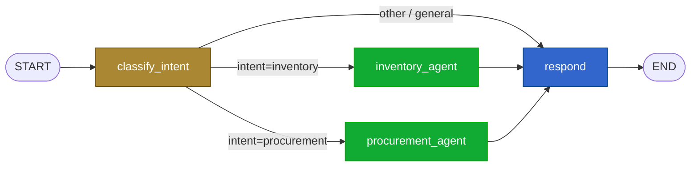
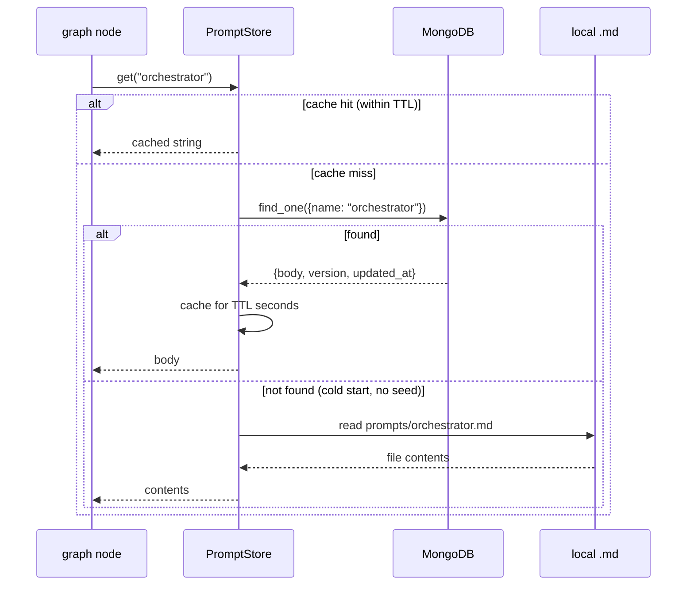

# Agents (LangGraph)

The agent layer is a **LangGraph stateful graph** that classifies user intent and
routes to one of five specialist agents. Each specialist owns a bounded set of
tools — thin HTTP wrappers over the backend API.

The hard rule: **the agent never writes silently**. Any state-changing tool returns
an `action_card_id` to the user via SSE for human confirmation.

## Module layout

```
agent/agent/
├── graph.py                    -- create_graph(): nodes + edges + checkpointer + store
├── state.py                    -- AgentState (extends MessagesState)
├── config.py                   -- env, BACKEND_URL, get_model(purpose), MongoDB URL
│
├── agents/
│   ├── orchestrator.py         -- classify_intent node
│   ├── inventory.py            -- InventoryAgent (Phase 1, wired)
│   ├── procurement.py          -- ProcurementAgent (Phase 1, wired)
│   ├── scheduler.py            -- SchedulerAgent (Phase 2, stub)
│   ├── yield_intel.py          -- YieldAgent (Phase 4, stub)
│   └── esg.py                  -- ESGAgent (Phase 4, stub)
│
├── tools/
│   ├── inventory_tools.py      -- query_lots, substitution_candidates
│   ├── procurement_tools.py    -- compute_landed_cost, build_order_draft, draft_negotiation
│   ├── scheduler_tools.py      -- (Phase 2, stub)
│   ├── yield_tools.py          -- (Phase 4, stub)
│   └── esg_tools.py            -- (Phase 4, stub)
│
├── prompts/
│   ├── orchestrator.md         -- system prompt for response synthesis
│   ├── intent_classifier.md    -- 12-shot label classifier
│   ├── negotiation.md          -- Opus 4.7 negotiation draft template
│   ├── store.py                -- PromptStore: MongoDB hot-reload + TTL cache + .md fallback
│   └── seed.py                 -- upsert default prompts to MongoDB
│
├── voice/
│   ├── whisper.py              -- faster-whisper STT (Phase 4)
│   ├── deepgram_stt.py         -- Deepgram alternative
│   └── verification.py         -- 4-level voice verification hierarchy
│
└── evaluation/
    └── opik_eval.py            -- Opik dataset + AnswerRelevance / Hallucination scorers
```

## Graph topology

The orchestrator routes by intent label. Currently `inventory` and `procurement`
are fully wired; `scheduler`, `yield`, and `esg` exist as stubs and fall through
to the `respond` node where Claude generates a "not yet implemented" reply.



When the other three specialists land, their nodes slot in via two new
`add_conditional_edges` mappings plus two new `add_edge(*, "respond")` calls. No
restructuring needed.

## AgentState

```python
class AgentState(MessagesState):
    intent: str | None = None              # set by classify_intent
    tool_results: list[dict] = []          # accumulated tool outputs
    action_cards: list[dict] = []          # cards emitted this turn
    facility_id: str | None = None         # current facility context
    langsmith_run_id: str | None = None    # cross-system trace id
```

`MessagesState` brings the standard `messages: list[BaseMessage]` field with the
correct reducer. The three list fields use additive reducers
(`lambda a, b: a + b`) so state accumulates across nodes within a turn.

## Memory and checkpointing

Two LangGraph mechanisms keep context across turns in the same thread:

| Mechanism | Class | What it persists |
| --- | --- | --- |
| Checkpointer | `MemorySaver` | The full `AgentState` snapshot per node, per thread — enables resume / replay |
| Store (LangMem) | `InMemoryStore` | Cross-turn facts keyed by namespace: e.g. `("facility", thread_id) → {"facility_id": "..."}` |

`facility_id` is the canonical example: a user mentions "Plant 1" once, the
InventoryAgent stashes it via `_save_facility_to_memory`, and subsequent turns in
the same thread can use it without re-asking. Both stores are in-memory today;
swap to durable backends (e.g. `RedisCheckpointSaver`) for production.

## Tools

Tools are `@tool`-decorated functions in `agent/agent/tools/*.py`. Each is also
wrapped in `@opik.track` so it appears as a span in the Opik dashboard.

Convention: every tool that ultimately writes state returns an `action_card_id`
in its result — never a write-success boolean. The HITL gate is the contract.

| Domain | Tool | Backend endpoint | State-changing? |
| --- | --- | --- | --- |
| Inventory | `query_lots(facility_id?)` | `GET /api/lots` | No |
| Inventory | `substitution_candidates(blocked_sku)` | `GET /api/substitution_candidates` | No |
| Procurement | `compute_landed_cost(supplier_id, items)` | `POST /api/procurement/landed_cost` | No |
| Procurement | `build_order_draft(supplier_id, items, delivery_date)` | `POST /api/orders/draft` | Yes → returns `action_card_id` |
| Procurement | `draft_negotiation(trigger_kind, data)` | `POST /api/negotiations/draft` (Phase 3) | Yes → returns `action_card_id` |

Read-only tools (`query_*`) are callable across specialists — the SchedulerAgent
may call `query_lots` to read inventory. Write-tools (`build_*`, `draft_*`) are
private to the owning domain.

## Prompt store

`agent/agent/prompts/store.py` loads prompts from MongoDB at runtime and caches
them in-process for `PROMPT_CACHE_TTL_SECONDS` (default 60s). Documents are
keyed by `name`; the default seed populates one per `.md` file under
`agent/agent/prompts/`.



This lets non-engineers tune prompts (push a doc update) without redeploying.
The `.md` files in the repo are the **fallback** and the **seed source** — they
are not the runtime source of truth once MongoDB is populated.

## LLM tier selection

Single chokepoint in `config.py::get_model(purpose)`:

| Purpose | Default model | Use case |
| --- | --- | --- |
| `"default"` | `claude-sonnet-4-6` | Intent classification, response synthesis, all agent tools |
| `"negotiation"` | `claude-opus-4-7` | Supplier negotiation draft generation (Phase 3, F3.13) — higher stakes, worth the cost |
| `"summary"` | `claude-sonnet-4-6` | Weekly summary narration (NF.O.2) — long-form structured prose |

Every Claude call must go through `get_model(purpose)`. No hard-coded model IDs
elsewhere. Env overrides: `DEFAULT_MODEL`, `NEGOTIATION_MODEL`, `SUMMARY_MODEL`.

## Tracing and evaluation

Two complementary observability layers:

- **LangSmith** — full graph traces. Enabled via `LANGCHAIN_TRACING_V2=true`.
  Each node, each tool call, each LLM call is a span. `langsmith_run_id` is
  carried through `AgentState` for cross-system correlation.
- **Opik** — dataset-driven evals. `agent/agent/evaluation/opik_eval.py` runs
  AnswerRelevance + Hallucination scorers against a fixed test set covering all
  six intent classes. CI gate is planned.

`@opik.track` decorators on each node (`classify_intent`, `_inventory_node`,
`_procurement_node`, `_respond_node`) and each tool produce nested spans —
useful for finding "which tool blew the token budget."

## How the agent is called from the backend

The chat endpoint (`backend/app/api/chat.py`) imports `agent.graph.stream` and
yields each chunk as an SSE event. Three event types are emitted:

- `event: message` — incremental text chunks for the user-facing reply
- `event: action_card` — a discrete `data: {action_card_id: "..."}` for the UI
  to render a confirm card
- `event: done` — end of stream

See [data-flow.md](data-flow.md#sse-event-types) for the full event contract.

## When to add a new agent

A new specialist is justified when:

1. It owns a bounded domain (its own tables, its own integrations) — see how
   `ProcurementAgent` owns SAP, MOQ, dock scheduling.
2. It has 2+ tools that are private to its domain (writes).
3. The intent classifier can disambiguate its requests from others.

Otherwise, extend an existing specialist. Five agents is plenty.
