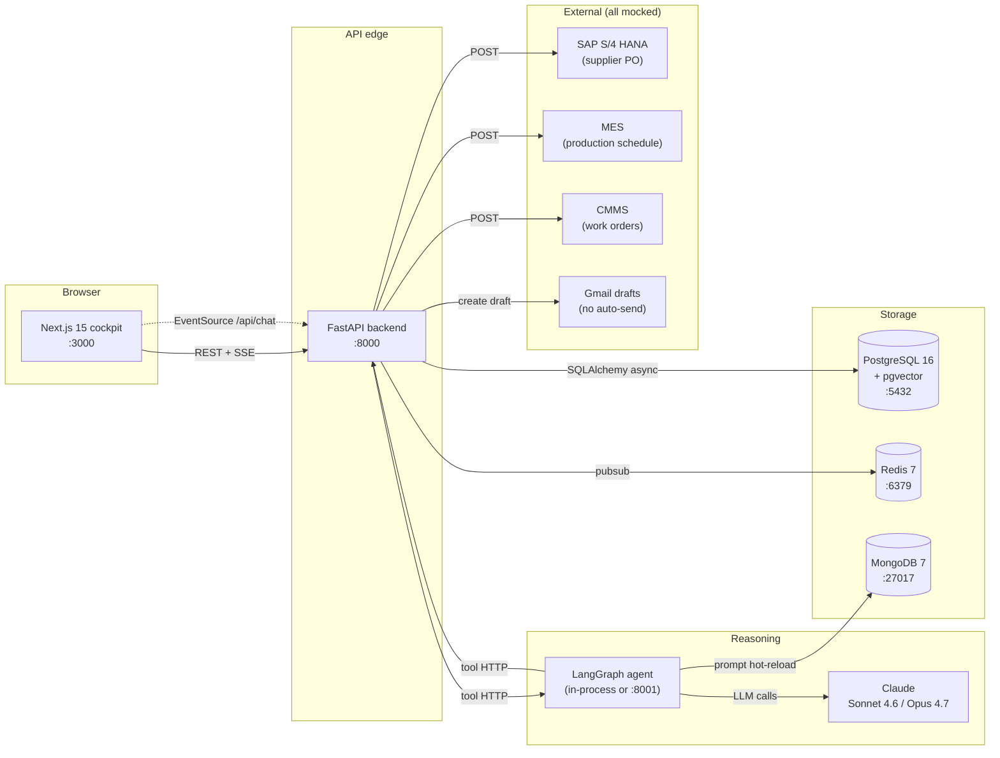
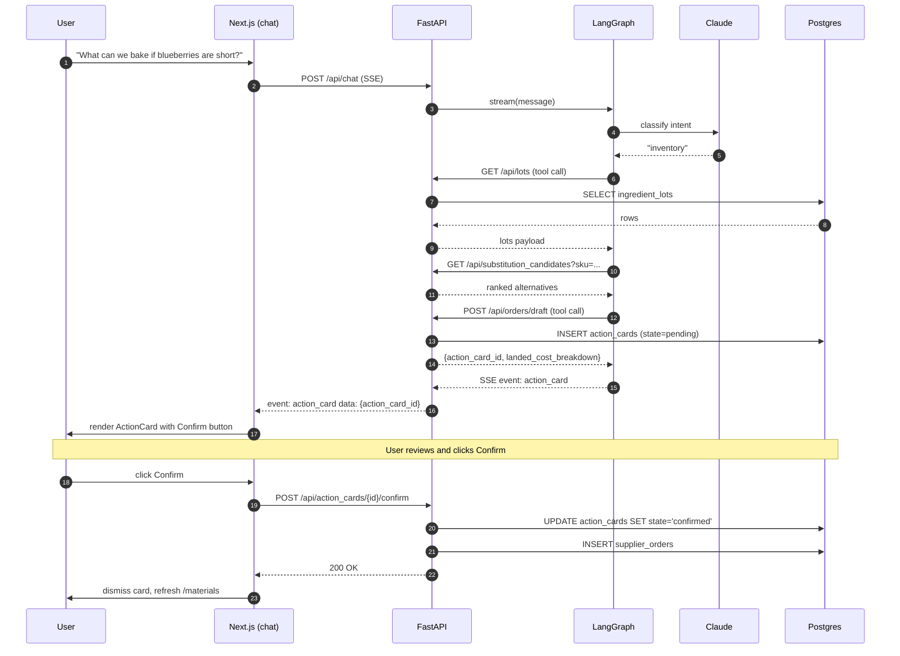

# System Architecture

BakeryPilot is an agentic operations copilot. A **Next.js cockpit** talks to a
**FastAPI backend** and a **LangGraph multi-agent orchestrator**, all backed by
**PostgreSQL + Redis + MongoDB**.

The core principle: every state-changing decision goes through a human-in-the-loop
`action_card` confirm. The agent never writes silently.

## Service map

## Tech stack

| Layer | Tech | Notes |
| --- | --- | --- |
| Frontend shell | Next.js 15 + React 19 + Tailwind + TypeScript | App router; native `EventSource` for SSE |
| Map cockpit | HTML canvas (PixiJS planned) | `FlowSightCanvas`: plants, suppliers, retailers, animated flows |
| Charts | Recharts | Demand bands, schedule diff |
| Graph viz | react-flow | Lot genealogy (recall view) |
| Agent orchestrator | LangGraph (Python) | Stateful, MemorySaver checkpointer, InMemoryStore for LangMem |
| LLM | Claude via `langchain-anthropic` | Sonnet 4.6 default; Opus 4.7 reserved for negotiation drafts |
| Backend API | FastAPI + Pydantic v2 | Async; one router per domain |
| Database | PostgreSQL 16 + pgvector | Vector ext for SOP/formula RAG |
| Queue / event stream | Redis 7 | Simulated telemetry, SSE multiplexing |
| Prompt store | MongoDB 7 | Hot-reload prompts without restart, TTL cache |
| Demand forecasting | LightGBM or Prophet | CPU-only |
| Scheduling optimizer | Google OR-Tools | Allergen-aware changeover constraint solver |
| Voice STT | faster-whisper (small, int8) or Deepgram | Local inference or hosted |
| Package mgmt | `uv` (Python), `npm` (Node) | All Python services use uv |
| Local dev | Docker Compose | `make up` for infra, `make up.full` for everything |

## Ports and processes

| Service | Port | Process | Start command |
| --- | --- | --- | --- |
| Postgres | 5432 | Docker | `docker compose up -d postgres` |
| Redis | 6379 | Docker | `docker compose up -d redis` |
| MongoDB | 27017 | Docker | `docker compose up -d mongo` |
| Backend | 8000 | `uv run uvicorn app.main:app` | `cd backend && make backend.run` |
| Agent | n/a (in-proc) | `uv run python -m agent.graph` | `cd agent && make agent.run` |
| Frontend | 3000 | `npm run dev` | `cd frontend && npm run dev` |

The agent currently runs as a Python module imported by the backend's `/api/chat`
endpoint. A separate agent worker process is planned but not split out yet.

## The walking skeleton

The non-negotiable end-to-end path. If this is green, the MVP demos. Everything
else layers on top.

The same shape applies to every state-changing flow — only the tool names and the
side effects at step 17 change.

## Operating modes

The backend ships in two modes. Both expose the same API surface.

| Mode | What runs | When to use |
| --- | --- | --- |
| **Mock** (default today) | Endpoints return data from `backend/app/mock_data.py`; no DB, no agent | Demo without infra; verifying contract shapes |
| **Wired** | Endpoints use SQLAlchemy + call LangGraph; integrations swap to real via env | The "real" walking skeleton; what the MVP-done bar requires |

Swap by replacing the imports in `app/api/*.py` from `mock_data` to the corresponding
service + DB session. The endpoint signatures and JSON Schemas don't change.

## Environment variables

Single source of truth: [`.env.example`](../.env.example). Required to run:

- `ANTHROPIC_API_KEY` — Claude API key
- `DATABASE_URL`, `REDIS_URL`, `MONGODB_URL` — defaulted to local Docker
- `BACKEND_URL` — where the agent calls the backend (defaults to `http://localhost:8000`)
- `NEXT_PUBLIC_BACKEND_URL` — frontend's backend URL (same default)

Integration toggles (all default to mock):
`SUPPLIER_USE_MOCK`, `MES_USE_MOCK`, `CMMS_USE_MOCK`, `GMAIL_USE_MOCK`.

## Mock parity

Every external integration has a mock that is byte-identical in interface to the
real client. The factory in `backend/app/integrations/factory.py` reads one env
var per system and returns the corresponding implementation. Switching to real
is a single env-var flip — no code change.

This guarantee is what keeps the demo offline-friendly while leaving a credible
upgrade path to production wiring.

## Schema-first contracts

`shared/schemas/*.schema.json` is the cross-service contract, frozen on Day 1.
Additive changes (new optional fields, new tables) are always OK; renames require
team agreement.

Both the backend Pydantic models and the frontend TypeScript types are generated
from (or validated against) the same JSON Schemas. The agent's tools emit payloads
that validate against them too. Three render targets, one source of truth.
