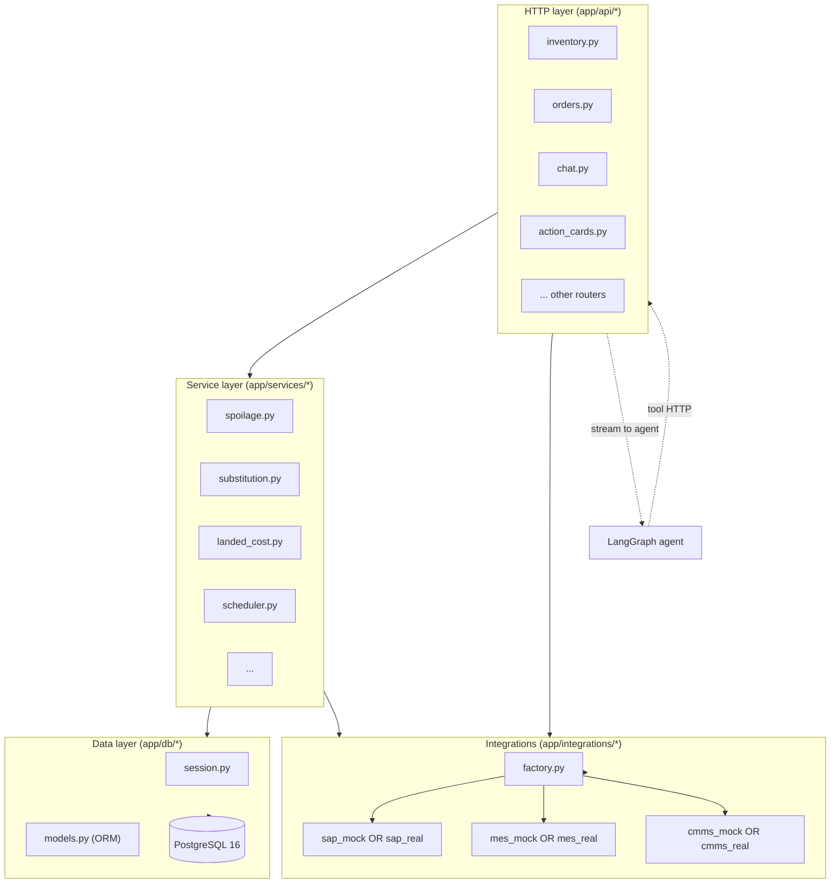
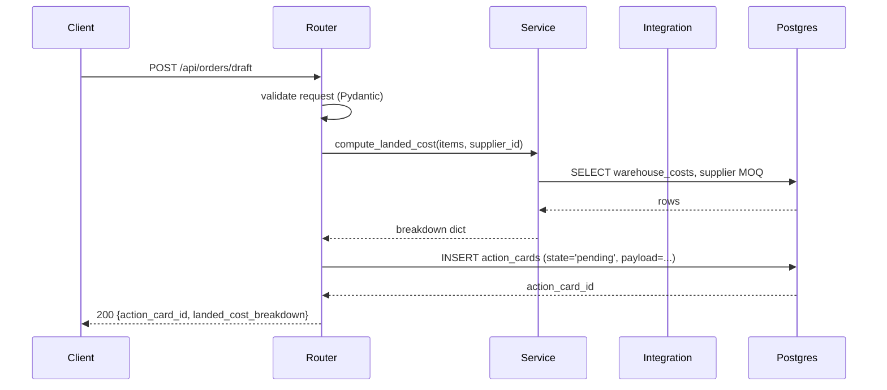
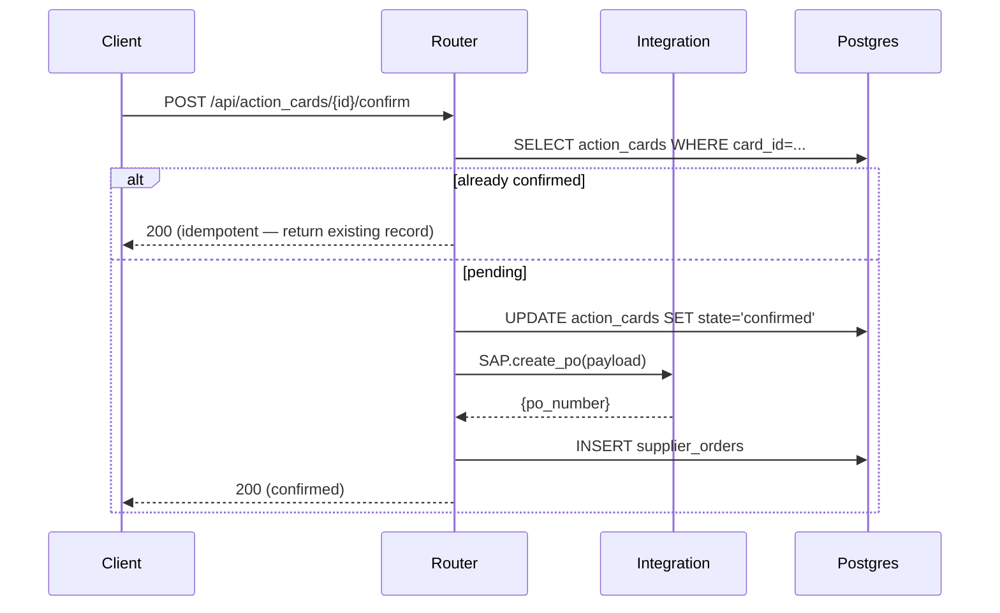

# Backend (FastAPI)

The backend is a FastAPI app under `backend/app/`. One router per domain, async
throughout, Pydantic v2 models, SQLAlchemy 2.0 async session.

## Module layout

```
backend/app/
├── main.py              -- FastAPI() instance, CORS, /healthz, router mounts
├── config.py            -- Settings via pydantic-settings
├── mock_data.py         -- Deterministic stub data used in mock mode
│
├── api/                 -- One router per domain (HTTP boundary)
│   ├── inventory.py     -- GET /api/lots, lot detail, spoilage
│   ├── suppliers.py     -- supplier master + scorecard
│   ├── orders.py        -- supplier_orders draft + retailer_orders intake
│   ├── action_cards.py  -- HITL: list, get, confirm, reject
│   ├── chat.py          -- POST /api/chat — SSE stream from agent
│   ├── schedules.py     -- production schedule, diff, what-if, MES post
│   ├── forecasts.py     -- demand forecasts (Phase 2)
│   ├── yield_intel.py   -- yield variance + anomaly (Phase 4)
│   ├── esg.py           -- waste counter, patterns, Scope 3 PDF (Phase 4)
│   ├── pallets.py       -- finished goods + FEFO (Phase 4)
│   ├── voice.py         -- STT proxy (Phase 4)
│   ├── notifications.py -- notification drafts log (NF.R.6)
│   ├── stakeholders.py  -- stakeholder directory (NF.R.7)
│   ├── summaries.py     -- weekly summaries (NF.O.x)
│   ├── events.py        -- SSE multiplexer for FlowSight overlays (Phase 5)
│   ├── disruptions.py   -- supplier disruption signals (Phase 3)
│   └── negotiations.py  -- negotiation drafts (Phase 3)
│
├── services/            -- Business logic (no HTTP, no FastAPI imports)
│   ├── spoilage.py            -- F1.11 spoilage risk score
│   ├── substitution.py        -- F1.12 substitution candidates
│   ├── landed_cost.py         -- F1.13 unit + overage + holding
│   ├── moq_engine.py          -- F3.6 MOQ overage + resolution paths
│   ├── delivery_window.py     -- F3.7 OR-Tools day picker
│   ├── disruption_risk.py     -- F3.10 supplier risk score
│   ├── stock_horizon.py       -- F3.9 reorder point
│   ├── contract_lifecycle.py  -- F3.11 60/30-day renewal flow
│   ├── payment_terms.py       -- F3.12 net-30 annualized rate
│   ├── scheduler.py           -- F2.5–F2.7 OR-Tools scheduler
│   ├── forecasting.py         -- F2.8 LightGBM / Prophet
│   ├── yield_intel.py         -- F4.4–F4.5 yield variance + diagnosis
│   ├── esg.py                 -- F4.8–F4.10 waste counter, patterns, PDF
│   ├── fefo.py                -- F4.12 FEFO outbound routing
│   ├── network_balancer.py    -- min-cost-flow cross-plant transfer
│   ├── procurement.py         -- aggregation surface for Module 4
│   └── negotiation_drafts.py  -- F3.13 Claude Opus draft writer
│
├── integrations/        -- External system clients (mock + real)
│   ├── factory.py             -- env-var-driven selector
│   ├── sap_mock.py            -- supplier PO confirmation (SAP S/4 HANA)
│   ├── mes_mock.py            -- production schedule post (MES)
│   ├── cmms_mock.py           -- maintenance work order create (CMMS)
│   ├── commodity_feed.py      -- CBOT wheat / butter / sugar prices
│   └── news_feed.py           -- supplier risk news signal
│
├── db/                  -- Persistence
│   ├── base.py                -- DeclarativeBase
│   ├── session.py             -- async_sessionmaker + get_db dependency
│   └── models.py              -- SQLAlchemy ORM models
│
└── models/              -- Pydantic v2 request/response models
    ├── common.py
    ├── chat.py
    ├── inventory.py
    ├── orders.py
    ├── schedules.py
    ├── suppliers.py
    ├── forecasts.py
    ├── yield_intel.py
    ├── esg.py
    ├── pallets.py
    ├── notifications.py
    └── summaries.py
```

## Layered architecture



**Rules:**

- Routers do request validation + auth + response shaping. No business logic.
- Services are pure(ish) functions of inputs to outputs. They may read the DB but
  do not import FastAPI.
- Integrations talk to external systems. Mocks live next to real clients with
  identical signatures.
- The DB layer exposes one async session per request via `get_db()`.

## Request lifecycle



Confirm step is the dual:



## Mock parity

Every external system gets a mock with the **same signature** as the real client.
Selection is by env var, in `app/integrations/factory.py`:

```python
def get_sap_client():
    if settings.supplier_use_mock:
        from app.integrations.sap_mock import SAPMock
        return SAPMock()
    from app.integrations.sap_real import SAPReal
    return SAPReal(token=settings.sap_token)
```

A mock that drifts from its real client is a bug. Add an integration parity test
(stretch goal S.4) if you wire a real client.

## Append-only audit tables

Three tables never accept UPDATE or DELETE — only INSERT:

- `inventory_events` — every lot consumption / receipt / adjustment
- `waste_events` — every avoidable / unavoidable kg lost
- `moq_tax_ledger` — every order's MOQ overage cost

Corrections are new rows, not updates. The append-only invariant is enforced by
a Postgres trigger (`raise_append_only` in `infra/supabase/schema.sql`). See
[database.md](database.md#append-only-audit-tables) for the trigger source.

## Mock mode vs. wired mode

The current backend ships in **mock mode**: `app/main.py`'s docstring notes that
endpoints return deterministic stub data from `app/mock_data.py`. Service files
in `app/services/` are mostly 1-line docstrings — the real implementations land
phase by phase per [`TASKS.md`](../TASKS.md).

The advantage of this layering: the **HTTP contract is stable today**. The
frontend, agent tools, and JSON Schemas all work against the mock surface and
will keep working once services + DB are wired.

## Healthcheck and observability

- `GET /healthz` returns `{"status": "ok", "mode": "mock" | "wired"}` — used by
  docker-compose, render, and the sanity script.
- Trace IDs from LangGraph (`langsmith_run_id`) are surfaced in agent responses
  for cross-system correlation.
- Append-only tables double as the audit log — no separate logging required for
  HITL decisions.
