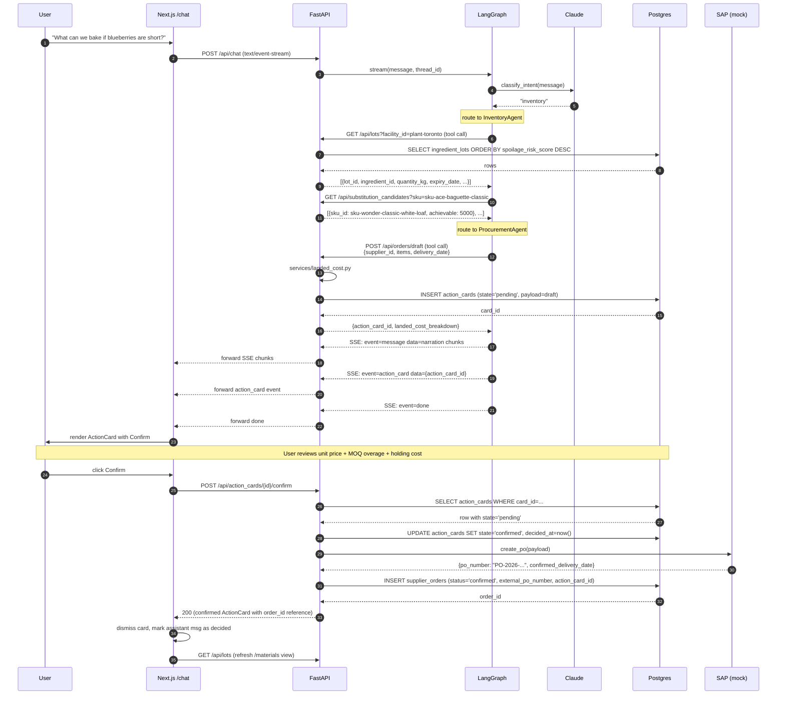
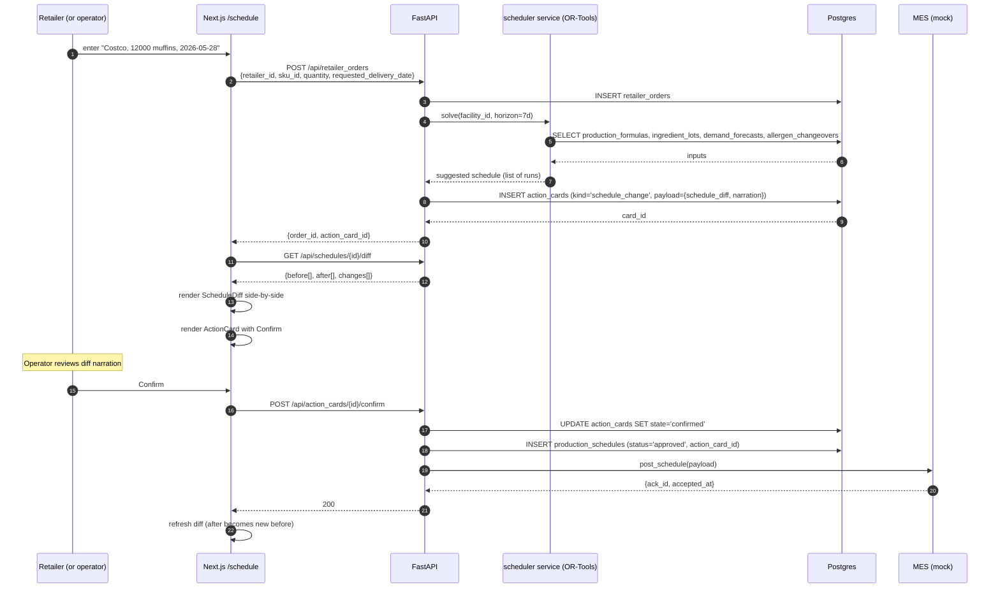

# Data Flow

End-to-end sequence diagrams for the key user-visible flows. The walking
skeleton (flow 1) is the foundation; everything else is a variant of the same
shape with different tools and side effects.

## Flow 1 — Walking skeleton: shortage question → confirmed PO

The canonical demo. A user asks what to do about a shortage; the agent
recommends a substitution and drafts a procurement order; the user confirms;
the order persists.



## Flow 2 — Retailer PO arrives → schedule re-tile

A new retailer order triggers a fresh schedule proposal. Same HITL shape as
flow 1; the tool and side effect change.



## Flow 3 — Live disruption signal → bridge PO drafted

The agent reacts proactively to a Redis-published supplier risk event. The user
sees a new action card without having typed anything.

```mermaid
sequenceDiagram
    autonumber
    participant FEED as commodity / news feed
    participant ES as event_stream.py
    participant RDS as Redis
    participant SUB as backend SSE subscriber
    participant API as FastAPI
    participant AG as LangGraph (ProcurementAgent)
    participant DB as Postgres
    participant FE as Next.js (any page)

    FEED->>ES: weather / news / commodity update
    ES->>RDS: PUBLISH disruption_signals {supplier_id, severity, source, message}
    RDS->>SUB: SUBSCRIBE delivery

    SUB->>DB: INSERT disruption_signals
    SUB->>API: services/disruption_risk.py — recompute score
    alt score >= threshold
        API->>AG: invoke ProcurementAgent.draft_bridge_po(supplier_id)
        AG->>API: build_order_draft(alternate_supplier, items, ...)
        API->>DB: INSERT action_cards (kind='supplier_order')
        DB-->>API: card_id

        Note over API: action_card available
        API-->>FE: SSE on /api/events: {type: 'action_card_created', card_id}
        FE->>FE: badge appears in nav; FlowSight supplier halo flips red
    end
```

This flow is Phase 3. The publisher (`infra/event_stream.py`) runs as a separate
process started by `make seed.events`.

## SSE event types

The chat endpoint emits three event types over a single stream:

| Event | `data:` payload | Frontend handler |
| --- | --- | --- |
| `message` | `{"content": "<chunk>"}` | Append chunk to last assistant message |
| `action_card` | `{"action_card_id": "<uuid>"}` | Fetch card via `GET /api/action_cards/{id}`, render `<ActionCard>` |
| `done` | `{}` | End-of-stream; release the EventSource |

Other event types reserved for future use:

| Event | When emitted | Source |
| --- | --- | --- |
| `tool_call` | Before each agent tool call | Phase 2 — for tool-breadcrumb UI |
| `intent` | After classify_intent | Optional — show "InventoryAgent thinking..." |
| `error` | On any unrecoverable error | Always |

For non-chat overlays (FlowSight live updates), the dedicated endpoint
`/api/events` will multiplex risk / yield / shelf-life / forecast events on a
single persistent SSE connection per session (planned, F5.10).

## HITL gate — invariants

Every state-changing flow upholds these:

1. **The agent never writes directly.** A tool that ultimately mutates state
   returns an `action_card_id` — never a write-success boolean. Audited by
   `NF.R.2`.
2. **The user's click is the commit.** `POST /api/action_cards/{id}/confirm` is
   the single chokepoint for applying any payload to the system.
3. **Idempotent confirm.** Calling `/confirm` twice on the same card returns the
   existing side-effect row id and does not double-write. Enforced by checking
   `state` before mutating.
4. **Reject leaves an audit trace.** Rejected cards stay in the table with
   `state='rejected'` + `decided_at` + `decided_by`. Nothing is deleted.
5. **Confirm fires the integration.** The mock SAP / MES / CMMS client is the
   last hop before the row lands in `supplier_orders` / `production_schedules` /
   work orders. Swapping mock for real is one env var.

## Failure modes and what the user sees

| Failure | User-visible behavior |
| --- | --- |
| Backend down | `streamChat` falls back to `mockReply()` — canned demo response, no card persisted |
| Agent throws mid-stream | `event: error` sent; frontend renders an inline error notice and keeps the partial message |
| `/confirm` 409 (already decided) | Frontend treats as success and dismisses the card |
| `/confirm` 404 (card expired or never existed) | Inline error: "this decision is no longer available" |
| SAP mock fails | `/confirm` rolls back the `action_cards` state mutation in a transaction, returns 502 with detail |

## Cross-references

- The SSE wire format is consumed by `frontend/src/lib/api.ts::streamChat`.
- The `action_card` payload shape is fixed by
  [`shared/schemas/action_card.schema.json`](../shared/schemas/action_card.schema.json).
- For the LangGraph node-by-node detail behind step "intent → route → agent →
  tool", see [agents.md](agents.md#graph-topology).
