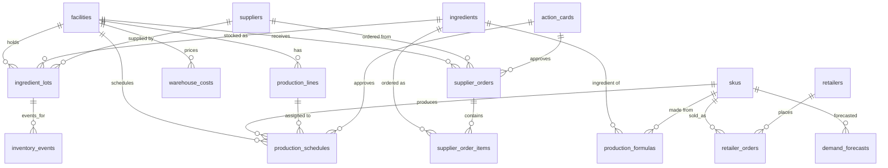

# Database

PostgreSQL 16 with **pgvector** (for SOP/formula RAG) and **pgcrypto** (for
`gen_random_uuid()`). Schema source of truth is
[`infra/supabase/schema.sql`](../infra/supabase/schema.sql).

## Rules

- **Append-only audit tables** (`inventory_events`, `waste_events`,
  `moq_tax_ledger`) — never UPDATE or DELETE. Corrections are new rows. A
  trigger enforces this; UPDATE/DELETE on these tables raises.
- **Schema is append-only at the source-file level too** — never edit existing
  table definitions. New tables and optional columns only. Renames require team
  agreement.
- **First boot auto-init** — `schema.sql` and `seed.sql` are bind-mounted into
  `/docker-entrypoint-initdb.d` and run automatically the first time Postgres
  starts on an empty volume. After that, use `make schema.migrate` and
  `make schema.seed` to re-apply.

## Domain map



## Tables by domain

### Master data (slow-changing reference)

| Table | Purpose | Phase |
| --- | --- | --- |
| `facilities` | Four FGF plants (Toronto, Mississauga, Hamilton, Montreal) | 1 |
| `ingredients` | 90 bakery-relevant items, USDA-informed shelf lives + allergens | 1 |
| `skus` | 12 finished products with per-unit margin (substitution ranks by this) | 1 |
| `production_lines` | 2–3 lines per plant, distinguished by supported allergens | 1 |
| `retailers` | Costco, Walmart, Loblaws, Whole Foods | 2 |
| `suppliers` | 5 suppliers, one per personality (reliable/cheap_late/high_moq/disrupted/new) | 1, extended P3 |
| `warehouse_costs` | $/kg/day per (facility, storage_type) | 1 |
| `allergen_changeovers` | Minutes lost per allergen transition (for scheduler) | 2 |
| `stakeholders` _(planned)_ | Directory of email recipients with role tags | NF.R.7 |

### Transactional / time-series

| Table | Purpose | Phase |
| --- | --- | --- |
| `ingredient_lots` | Per-lot inventory with expiry + storage zone | 1 |
| `production_formulas` | Bill of materials per SKU | 2 |
| `production_schedules` | Approved + suggested production runs (versioned) | 2 |
| `production_runs` _(planned)_ | Actual outcomes per run (yield variance source) | 4 |
| `retailer_orders` | Firm POs from retailers | 2 |
| `demand_forecasts` | Per-SKU 14-day forecast bands | 2 |
| `supplier_orders` + `supplier_order_items` | PO header + line items | 1 |
| `action_cards` | HITL approval queue (every state-changing decision) | 1 |
| `dock_schedules` _(planned)_ | Receiving slot bookings per plant per day | 3 |
| `finished_goods_pallets` _(planned)_ | Pallet shelf-life + status | 4 |
| `negotiation_drafts` _(planned)_ | Generated supplier negotiation emails | 3 |

### Append-only audit

| Table | Purpose | Trigger active? |
| --- | --- | --- |
| `inventory_events` | Lot consumption / receipt / transfer / adjustment / spoilage | Yes |
| `waste_events` _(planned)_ | Avoidable + unavoidable waste with $ + CO2e | Pending table |
| `moq_tax_ledger` _(planned)_ | Quarterly MOQ overage cost per supplier | Pending table |
| `notification_drafts` _(planned)_ | Every Gmail draft created (audit trail) | Pending table |
| `weekly_summaries` _(planned)_ | Monday weekly summary archive | Pending table |

The append-only enforcement is a single reusable function:

```sql
CREATE OR REPLACE FUNCTION raise_append_only()
RETURNS trigger LANGUAGE plpgsql AS $$
BEGIN
  RAISE EXCEPTION 'Table % is append-only; INSERT new rows for corrections instead of % on row.',
    TG_TABLE_NAME, TG_OP;
END;
$$;

-- Attach to any audit table:
CREATE TRIGGER inventory_events_append_only
  BEFORE UPDATE OR DELETE ON inventory_events
  FOR EACH ROW EXECUTE FUNCTION raise_append_only();
```

## Phase-by-phase additions

| Phase | New tables | Schema-changing? |
| --- | --- | --- |
| 1 (MVP) | facilities, ingredients, skus, production_lines, suppliers (basic), warehouse_costs, ingredient_lots, supplier_orders + items, action_cards, inventory_events | All CREATE TABLE |
| 2 | allergen_changeovers, retailers, production_formulas, production_schedules, retailer_orders, demand_forecasts | All CREATE TABLE |
| 3 | ALTER `suppliers` ADD moq_kg, lead_time_*, window_*, discount_tiers; CREATE dock_schedules, moq_tax_ledger, disruption_signals, negotiation_drafts | Additive ALTER + CREATE |
| 4 | production_runs, waste_events, finished_goods_pallets | All CREATE TABLE |
| Non-functional | stakeholders, notification_drafts, weekly_summaries | All CREATE TABLE |

Every Phase 2+ change must be additive — existing rows from earlier phases keep
working without backfill. New columns must be nullable or have defaults.

## Seed data

Two seed paths:

1. **Deterministic** — [`infra/supabase/seed.sql`](../infra/supabase/seed.sql)
   inserts master data: 4 facilities, 5 suppliers, 12 warehouse cost rows,
   4 retailers, 28 allergen-changeover rows, 90 ingredients, 12 SKUs, 60+
   production-formula rows, 9 production lines, 8 retailer orders.
2. **Generated** — [`infra/seed_lots.py`](../infra/seed_lots.py) uses Faker to
   create 150+ ingredient lots with realistic expiry distributions: most >7 days,
   a tail <3 days (forces red-badge demo), a few past expiry (audit edge case).
   Idempotent: rerun clears and reinserts.

The split is intentional: the static seed is the schema's reference data; the
generated lots are the live, demoable inventory state.

## Verifying a healthy seed

```bash
make db.status
```

Expected counts:

| Table | Count |
| --- | --- |
| facilities | 4 |
| suppliers | 5 |
| retailers | 4 |
| ingredients | 90 |
| skus | 12 |
| production_lines | 9 |
| production_formulas | 60+ |
| warehouse_costs | 12 |
| allergen_changeovers | 28 |
| retailer_orders | 8 |
| ingredient_lots | 150+ |
| inventory_events | 0 (populated by the agent at runtime) |

## Resets

| Goal | Command | Destructive? |
| --- | --- | --- |
| Restart Postgres (keep data) | `docker compose restart postgres` | No |
| Re-apply schema + seed against existing volume | `make schema.migrate && make schema.seed` | No (uses `IF NOT EXISTS` + `ON CONFLICT DO NOTHING`) |
| Wipe everything and start over | `make reset` | Yes — drops the named volume |

## Conventions

- IDs: `text` for human-readable references (`plant-toronto`, `sup-northgrain`,
  `sku-blueberry-muffin-4pk`); `uuid DEFAULT gen_random_uuid()` for system-generated
  rows (lots, action_cards, orders).
- Timestamps: always `timestamptz`. Dates only where date-only semantics matter
  (`expiry_date`, `requested_delivery_date`).
- Enums: implemented as `CHECK (column IN ('a','b','c'))` rather than Postgres
  ENUM types — easier to ALTER additively.
- Money: `numeric` (never `float`). Quantities: `numeric` with implicit kg unit
  unless a column is suffixed `_units`.
