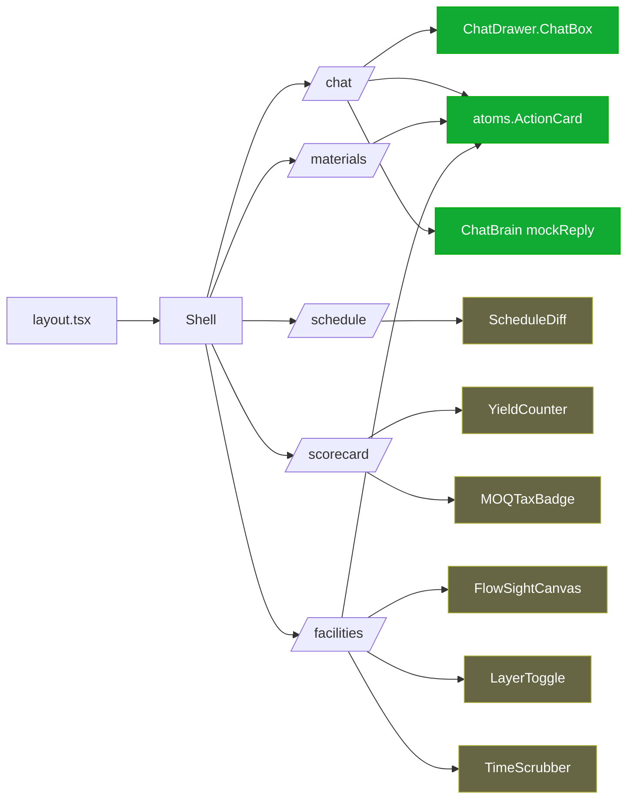
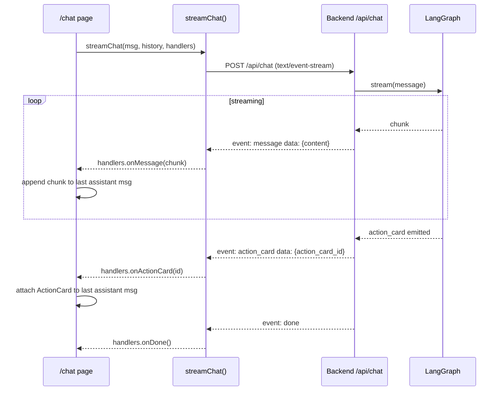

# Frontend (Next.js 15)

The frontend is a Next.js 15 app under `frontend/`. App router, React 19,
TypeScript, Tailwind. Native `EventSource` for SSE streaming chat.

## Module layout

```
frontend/src/
├── app/                      -- App-router pages
│   ├── layout.tsx            -- root layout, Tailwind globals, header
│   ├── page.tsx              -- landing
│   ├── chat/page.tsx         -- chat + ActionCard sidecar
│   ├── materials/page.tsx    -- ingredient lots + risk badges
│   ├── schedule/page.tsx     -- production schedule + diff view
│   ├── scorecard/page.tsx    -- ESG counter + forecast bands
│   └── facilities/page.tsx   -- FlowSight cockpit
│
├── components/
│   ├── Shell.tsx             -- app shell (sidebar nav)
│   ├── Icon.tsx              -- icon set
│   ├── atoms.tsx             -- ActionCard, Pill, Dot, ToolBreadcrumbs, primitives
│   ├── ChatDrawer.tsx        -- ChatBox input control with voice button
│   ├── ChatDrawerWrapper.tsx -- positioning wrapper
│   ├── ChatBrain.ts          -- sample cards + mock reply heuristics
│   ├── FlowSightCanvas.tsx   -- top-down strategy-game canvas (plants, suppliers, retailers, flows)
│   ├── FactoryView.tsx       -- plant-floor zoom variant (stub today)
│   ├── LayerToggle.tsx       -- risk / yield / shelf-life / forecast toggles (stub)
│   ├── TimeScrubber.tsx      -- replay last 24h of events (stub)
│   ├── ScheduleDiff.tsx      -- before/after schedule columns (stub)
│   ├── MOQTaxBadge.tsx       -- per-supplier MOQ-tax indicator (stub)
│   ├── SupplierCard.tsx      -- supplier scorecard (stub)
│   ├── YieldCounter.tsx      -- live dollar waste counter (stub)
│   └── LotGenealogyGraph.tsx -- react-flow lot lineage (stub)
│
└── lib/
    ├── api.ts                -- typed HTTP + SSE client
    ├── context.tsx           -- React context providers
    ├── data.ts               -- static demo data (suppliers, retailers, disruptions)
    └── hooks.ts              -- shared React hooks
```

> **Naming note:** the original task scope (F1.24) named `ChatBox.tsx` and
> `ActionCard.tsx` as the component files. The real implementations live in
> `ChatDrawer.tsx` (ChatBox input control) and `atoms.tsx` (the `ActionCard`
> render component). The files at the originally-named paths are 4-line stubs
> kept for historical reference. New code should import from the working files.

## Page → component map



`FlowSightCanvas` itself is implemented (463 lines, renders all 13 nodes + flows)
but uses plain HTML canvas rather than the PixiJS target from the spec.

## API client (`lib/api.ts`)

Typed wrapper around `fetch` for every backend endpoint plus a thin SSE helper.
Base URL comes from `NEXT_PUBLIC_BACKEND_URL` (throws at import time if unset).

Key surface:

```ts
// REST
export async function getLots(facilityId?: string): Promise<IngredientLot[]>
export async function getSubstitutionCandidates(sku: string): Promise<SubstitutionResult>
export async function postOrderDraft(req: SupplierOrderDraftRequest): Promise<SupplierOrderDraftResponse>
export async function confirmActionCard(cardId: string): Promise<ActionCard>
export async function rejectActionCard(cardId: string): Promise<ActionCard>

// SSE
export async function streamChat(
  message: string,
  history: ChatMessage[],
  handlers: {
    onMessage: (chunk: string) => void
    onActionCard: (id: string) => void
    onDone: () => void
    onError: (err: Error) => void
  }
): Promise<void>
```

## SSE handling in chat

The `/chat` page uses `streamChat` to demultiplex three SSE event types:



Fallback: if the backend is unreachable or returns nothing within the stream,
the page calls `mockReply(input)` from `ChatBrain.ts` to render a canned demo
response. This keeps the UI responsive when the backend is down — useful for
frontend iteration without booting the whole stack.

## ActionCard contract

`ActionCard` (in `atoms.tsx`) renders the HITL confirm UI. Two states:

1. **Pending** — shows summary fields (unit price, MOQ overage, holding cost,
   delivery date for `supplier_order`; before/after schedule for `schedule_change`)
   with `Confirm` and `Reject` buttons.
2. **Decided** — greyed out, decision and timestamp shown.

UX rule (NF.U.2): **Enter in the chat input does NOT confirm the card.** Confirm
is always an explicit button click. This prevents accidental commits while typing.

## FlowSight cockpit (`/facilities`)

The "strategy-game" map view. Top-down canvas with:

- **Left rail:** 5 supplier nodes (NorthGrain, Valley Dairy, Prairie Bulk, Coastal
  Berry, New Leaf) — halo color = current disruption risk.
- **Center:** 4 plant nodes (Toronto, Mississauga, Hamilton, Montreal) — utilization
  bars per storage zone, status dot.
- **Right rail:** 4 retailer nodes (Costco, Walmart, Loblaws, Whole Foods) — incoming
  PO indicator.
- **Flows:** inbound (supplier → plant) and outbound (plant → retailer) animated lines
  with cargo labels.

Layer toggles (planned, currently stubs):

| Layer | Source | Visual |
| --- | --- | --- |
| Risk | `disruption_signals` stream | Colored halos on supplier nodes |
| Yield | per-plant `production_runs` deltas | Floating dollar counter on plant nodes |
| Shelf-life | `finished_goods_pallets` | Tile grid colored by days-remaining |
| Forecast | `demand_forecasts` | Bar on retailer nodes; approaching trucks |

## State management

No global store. State stays local to pages; React Context is used sparingly via
`lib/context.tsx`. The reasoning: the agent owns the cross-page intelligence, the
backend owns persistence, so the frontend doesn't need a Redux-style layer.

If you add a feature that genuinely needs cross-page reactive state (e.g.
notification badges that update on backend SSE events), the right move is a
single root-level SSE subscriber that fans out via Context.

## Styling

Tailwind only. No CSS modules, no styled-components. Design tokens live in the
Tailwind config; component variants are encoded inline. The dark theme is the
default and only theme.

## Adding a new page

1. Create `frontend/src/app/<slug>/page.tsx`.
2. Wire any new endpoint into `lib/api.ts` with a typed return.
3. If it needs JSON Schema-validated payloads, generate the TS type from
   `shared/schemas/*.schema.json` (NF.S.4) rather than hand-writing it.
4. Render loading + empty states (NF.U.4) — no blank screens on first paint.
